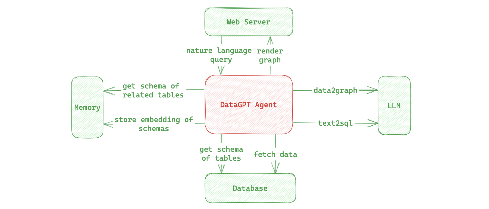

# DataGPT

DataGPT是一个小巧但完整的智能体应用，允许用户以自然语言输入查询。它试图理解用户的意图，从数据库中检索相关数据，生成相应的图表，并通过Web界面向用户提供反馈。该项目的目标是使数据查询和可视化更加简单和直观。



## 设计原则

- 保持代码尽可能简单，以便易于理解和修改。

- 反映AI智能体的概念，利用AI完成复杂任务。

## 主要功能

- 自然语言查询：用户可以用自然语言表达查询，无需编写复杂的查询语句。

- 数据可视化：DataGPT可以生成各种类型的图表，包括柱状图、折线图、饼图等，以更好地表示数据。

- Web界面：用户可以通过简单的Web界面与DataGPT进行交互，输入查询并查看生成的图表。

## 后续开发

- [ ] 根因分析：自动搜索数据库中与用户提出的问题相关的根本原因。

- [ ] 数据洞察：根据用户提出的引导性问题主动从数据库中挖掘信息。

- [ ] 交互提升：支持用户多轮问答的交互方式，提高对问题的包容性。

- [ ] 图表优化：增强和优化图表生成的可控性。

- [ ] 数据库适配：支持更广泛的关系数据库和数据仓库。

## 安装和配置

1. 将存储库克隆到本地计算机：

   ```bash
   git clone https://github.com/digai-co/DataGPT.git
   cd DataGPT
   ```

2. 创建并激活虚拟环境（可选但建议）：

   ```bash
   python -m venv venv
   source venv/bin/activate
   ```

3. 安装依赖项：

   ```bash
   pip install -r requirements.txt
   ```

4. 使用 [docker](https://docs.docker.com/engine/install/) 创建数据库并导入数据（可选）：
   ```
   # postgresql
   sh examples/db/run_pg.sh cn
   ```
   ```
   # mysql
   sh examples/db/run_mysql.sh cn
   ```

5. 根据您的openai信息和数据库信息编辑配置文件：

   ```yaml
   llm:
     openai:
       api_base:  # https://api.openai.com/v1 or your azure api base
       api_key:   # your api key
       api_model: # gpt-3.5-turbo

    database:
      type: postgresql # support postgresql or mysql now
      uri: postgresql://postgres:@localhost:5432/datagpt # database uri

    memory:
      dir: data  # long-term memory directory
      schema_file: schema # schema cache file
   ```

6. 运行应用程序：

   ```bash
   python server/app.py
   ```

7. 访问Web界面：打开Web浏览器并访问URL以使用DataGPT。

## 使用示例

1. 打开Web界面并输入您的查询请求。

2. DataGPT将解析您的请求，从数据库中提取相关数据，并生成相应的图表。

3. 查看生成的图表，您可以下载它们进行分享。

## 故障排除

### 问题：如果数据库的schema更新了，缓存中的信息过时导致DataGPT无法正常工作，该怎么办？
**解决方案：** 如果您发现缓存中的数据库schema信息已过时，您可以采取以下步骤来更新它：

1. 删除位于项目根目录下的data子目录中的缓存文件。您可以使用以下命令删除缓存文件：
    ```bash
    rm -rf data/*
    ```
2. 重新启动应用程序：
    ```bash
    python server/app.py
    ```

## 贡献

如果您希望为项目做出贡献，您可以：

- 我们列出的后续开发的功能，非常欢迎大家提交pr。

- 提出问题并提供建议，以帮助我们改进项目。

## 许可证

本项目在[MIT许可证](LICENSE.md)下发布。

## 作者

DataGPT由[DigAI.co 团队](https://digai.co)创建和维护，团队成员包括董道国、王焘等...